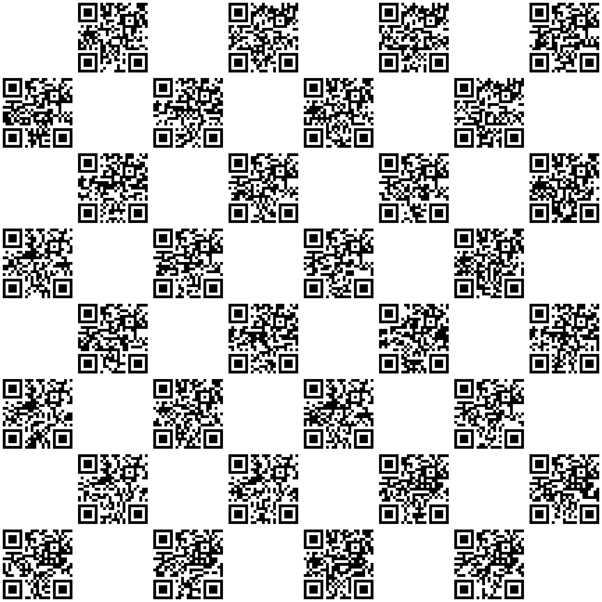

# QR Chessboard generator
Generator for a chessboard made with QR images from a list of links

#Installation:
-    clone the repo 
-    Install the dependeny "segno"  ("pip install segno" : https://pypi.org/project/segno/ - used for QR generation)
-Install the dependeny "pillow"  ("pip install pillow" : https://pypi.org/project/Pillow/ - used for image editing)
-Edit the "chess_links.txt" with a new link on each line.
-run "generate_chessboard.py"

This will generate an image for each of your links and add them to a chessboard, for example:

